# El7a2ny Virtual Clinic and Pharmacy
## Motivation

El7a2ny Virtual Clinic and Pharmacy is not just a software solution; it's a revolutionary approach to healthcare. In a world where convenience and efficiency matter, our goal is to redefine the concept of "Telehealth" by leveraging cutting-edge technologies and techniques.

### Vision

Our vision is to bridge the gap between doctors and patients, making healthcare more accessible and convenient. We aspire to eliminate the need for physical clinic visits for routine check-ups. With a simple click of a button, patients can connect with their doctors seamlessly through high-quality video calls.

### Key Features

- **Virtual Consultations:** Say goodbye to long waiting times and commuting. Connect with your healthcare provider instantly from the comfort of your home.
  
- **Cutting-Edge Technologies:** We employ state-of-the-art technologies to ensure a secure, reliable, and user-friendly experience.

- **Patient-Centric Approach:** Our platform is designed with the patient in mind, prioritizing ease of use, accessibility, and personalized healthcare.

## Build Status

[](https://your-build-url)

The current version of El7a2ny Virtual Clinic and Pharmacy is successfully passing all builds. We are committed to delivering a robust and reliable platform. In the rare event of any hidden glitches, rest assured that they are diligently handled, and they do not pose code-breaking issues. Our development team is proactive in addressing and resolving any unexpected issues to ensure a seamless experience for our users.

## Code Style

El7a2ny Virtual Clinic and Pharmacy follows a clear and organized coding structure based on the Model-View-Controller (MVC) architecture. This separation of concerns enhances maintainability and scalability by isolating the application logic, user interface, and data.

### MVC Architecture

- **Model:** Manages data and business logic. This layer is responsible for interacting with the database and processing data.

- **View:** Presents information to the user and handles user interface components. This layer ensures a clean separation between the application's logic and its presentation.

- **Controller:** Acts as an intermediary between the Model and View, processing user input and updating the Model and View accordingly. This layer helps in maintaining the flow of data between the Model and View.

### Routes for Code Organization

To enhance code readability and maintainability, we leverage routing mechanisms. Routes in our application serve as a roadmap, making it easier to understand the flow of data and actions within the codebase. This approach results in cleaner and more organized code.

## Frameworks and Technologies Used

El7a2ny Virtual Clinic and Pharmacy is built on the MERN (MongoDB, Express.js, React, Node.js) stack, with the addition of Next.js for seamless server-side rendering and enhanced performance.

### MERN Stack

- **MongoDB:** A NoSQL database for storing and managing data efficiently.

- **Express.js:** A web application framework for Node.js that simplifies the creation of robust APIs.

- **React:** A JavaScript library for building user interfaces. The front-end of our virtual clinic is developed using React to ensure a dynamic and responsive user experience.

- **Node.js:** A server-side runtime environment that allows us to run JavaScript on the server. It powers the backend of our application.

- **Next.js:** A React framework that enables server-side rendering and other performance optimizations for our user interface.

### Payment Integration

- **Stripe:** We leverage Stripe for seamless and secure payment processing, providing a reliable solution for transactions within our virtual clinic and pharmacy.

### User Interface

- **Material-UI (MUI) Templates:** Our user interface benefits from the design principles and components provided by Material-UI. This ensures a consistent and visually appealing experience for our users.

By combining these technologies, we aim to deliver a robust, scalable, and user-friendly platform for virtual healthcare and pharmacy services.


## Features

### For Doctors:

- **Registration and Account Management:** Doctors can easily register and manage their accounts. Each doctor has their own wallet, allowing them to handle transactions seamlessly.

- **Hourly Rate Management:** Doctors can set their hourly rates and publish their available time slots for appointments.

### For Patients:

- **User Registration and Profile:** Patients can register, create profiles, and view details about different doctors and their specialties.

- **Appointment Booking:** Patients can book appointments with doctors based on their availability.

- **Chat and Video Calls:** After completing appointments, patients can engage in chat with doctors and make video calls for follow-up consultations.

- **Health Packages Subscription:** Patients can subscribe to health packages (Silver, Gold, Platinum) offering discounts based on the tier.

- **Family Members Management:** Patients can add family members to their accounts, extending subscription benefits to them.

- **Pharmacy Services:** Patients can purchase medicines from the pharmacy section, checkout, and track their orders. They can also engage in chat with the pharmacy.

- **Password Reset:** Patients can reset their passwords via email if forgotten.

### For Pharmacists:

- **Registration and Account Management:** Pharmacists can register, manage their accounts, and add medicines to the inventory.

- **Medicine Management:** Pharmacists can categorize medicines as over-the-counter (OTC) or prescription-only. Medicines can be archived or unarchived as needed.

### For Admins:

- **Account Approval:** Admins have the authority to approve new doctor and pharmacist accounts.

These features collectively make El7a2ny Virtual Clinic and Pharmacy a comprehensive platform for streamlined healthcare services, connecting doctors, patients, and pharmacists efficiently.

## Credits

### Frameworks, Libraries, and Resources

- [Material-UI (MUI) Devias Kit](https://mui.com/store/items/devias-kit/): Credits to the creators of the MUI Devias Kit for providing a foundation of design principles and components that significantly contributed to the visual aesthetics and user experience of El7a2ny Virtual Clinic and Pharmacy.

### Educational Resources

- [Net Ninja Node.js YouTube Playlist](https://www.youtube.com/watch?v=zb3Qk8SG5Ms&list=PL4cUxeGkcC9jsz4LDYc6kv3ymONOKxwBU): Gratitude to Net Ninja for the informative and insightful Node.js tutorials. These resources played a crucial role in shaping the backend architecture of our virtual clinic.

- [Net Ninja React YouTube Playlist](https://www.youtube.com/watch?v=j942wKiXFu8&list=PL4cUxeGkcC9gZD-Tvwfod2gaISzfRiP9d): Special thanks to Net Ninja for the comprehensive React tutorials. These tutorials were instrumental in the development of the frontend, ensuring a smooth and responsive user interface.

### Other Contributions

- [Any Other Third-Party Libraries or Resources Used](#): Acknowledgment to the creators of any additional libraries or resources that have been utilized in the development of El7a2ny Virtual Clinic and Pharmacy.

We extend our appreciation to the developers, educators, and contributors whose work has played a key role in the success of this project.

## License

### El7a2ny Virtual Clinic and Pharmacy


### Third-Party Licenses

- **Stripe:** Payment processing in El7a2ny Virtual Clinic and Pharmacy is facilitated by Stripe. Please refer to the [Stripe Terms of Service](https://stripe.com/terms) for information on licensing and usage.

- **MUI Devias Kit:** The Material-UI Devias Kit is used for design and user interface components. Refer to the [Devias Kit License](https://mui.com/store/items/devias-kit/) for licensing details.

- **Net Ninja Node.js and React YouTube Playlists:** The educational resources provided by Net Ninja are subject to their respective licenses. Please check the terms on the [Net Ninja YouTube Channel](https://www.youtube.com/@NetNinja) for more information.

- **Any Other Third-Party Libraries or Resources Used:** Check the documentation or respective repositories for licensing details of any additional libraries or resources utilized in El7a2ny Virtual Clinic and Pharmacy.

It is essential to review and comply with the licenses associated with the third-party components used in this project.


## Screenshots

### Dashboard

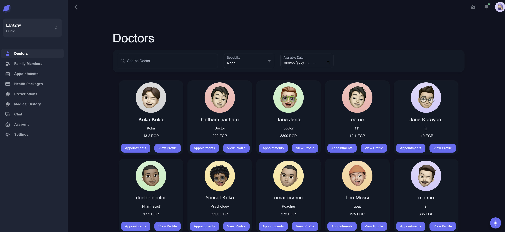

### Doctor's Profile

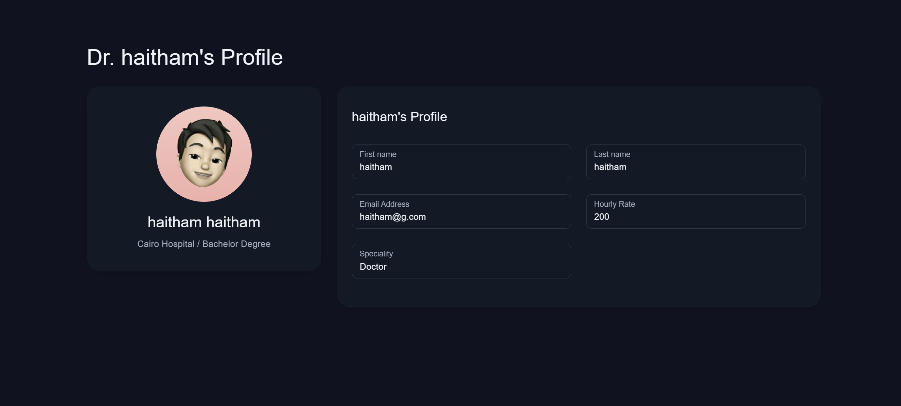

### Appointment Booking

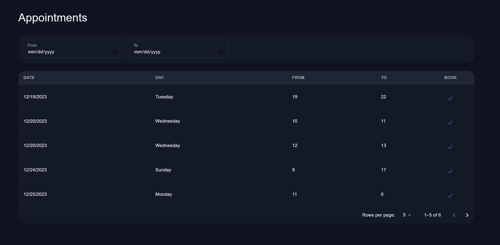

### Appointment Payment

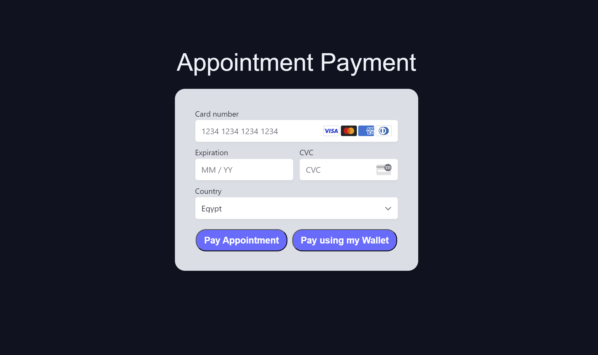

### Pharmacy Section

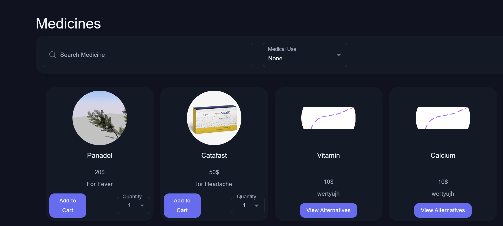

### Pharmacy Cart

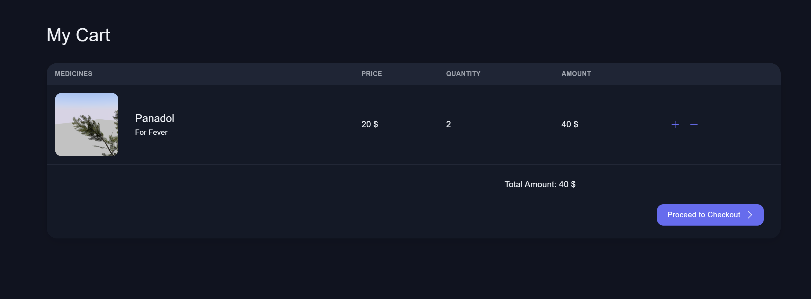

## Code Snippets

Backend of pay with Wallet Method

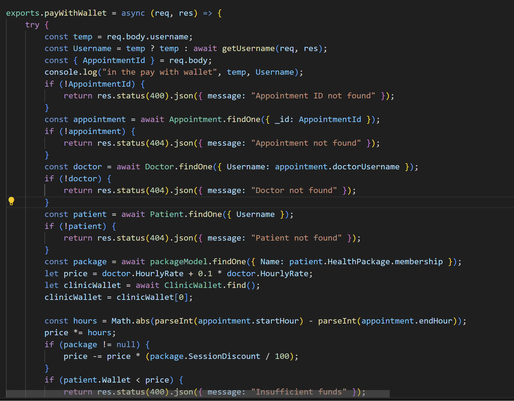
### ----------------------------------------------

Frontend code of getting appointments

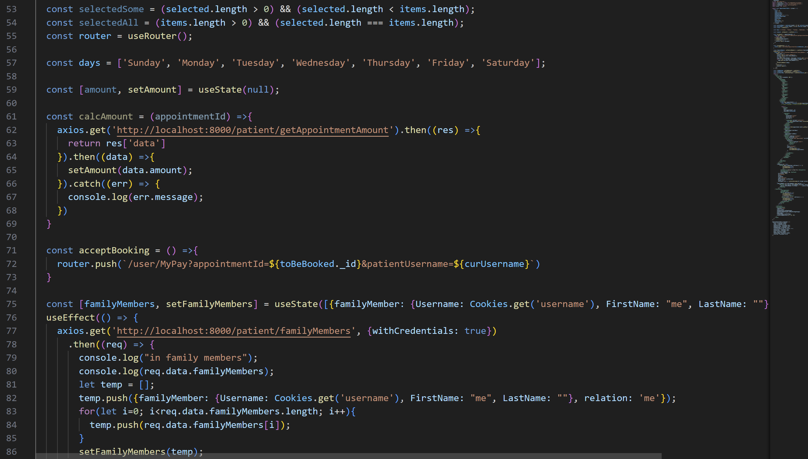
### ----------------------------------------------

Backend of getting all prescriptions

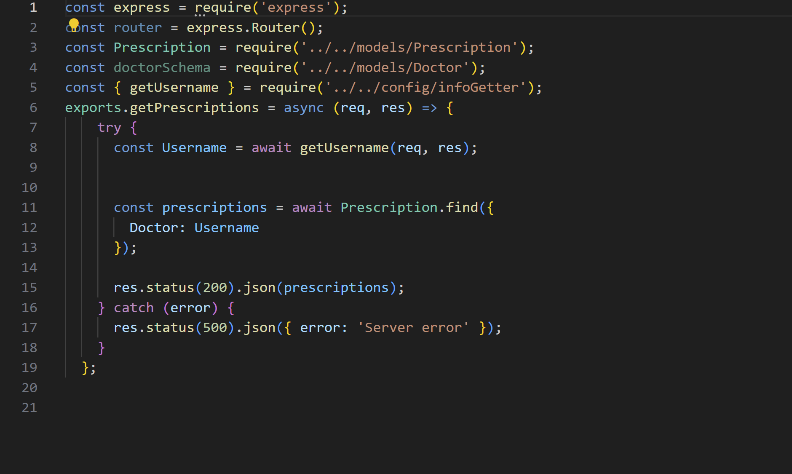


## API Reference

### Patient Routes

#### Register

- **Endpoint:** `/register`
- **Method:** GET
- **Description:** Renders the patient registration view.

#### Get Patients

- **Endpoint:** `/getPatients`
- **Method:** GET
- **Description:** Retrieves a list of patients.

#### Get Me

- **Endpoint:** `/getMe`
- **Method:** GET
- **Description:** Retrieves the details of the currently authenticated patient.

...

#### Download Prescription PDF

- **Endpoint:** `/download-prescription-pdf`
- **Method:** POST
- **Description:** Generates a PDF version of a prescription.

#### View Health Records

- **Endpoint:** `/:username/health-records`
- **Method:** GET
- **Description:** Retrieves health records for a specific patient.

...

#### Add Prescription

- **Endpoint:** `/addPrescription`
- **Method:** POST
- **Description:** Adds a prescription.

...

#### Subscribe Health Package

- **Endpoint:** `/subscribeHealthPackage`
- **Method:** POST
- **Description:** Subscribes a patient to a health package.

...

#### Pay with Wallet Package

- **Endpoint:** `/payWithWalletPackage`
- **Method:** PATCH
- **Description:** Allows a patient to pay for a health package using their wallet.

...

#### View Available Packages

- **Endpoint:** `/getAvailablePackages`
- **Method:** GET
- **Description:** Retrieves a list of available health packages.


### Doctor Routes

#### Register

- **Endpoint:** `/register`
- **Method:** POST
- **Description:** Registers a new doctor, including file uploads for national ID, medical degree, and medical license.

#### View Doctor Register

- **Endpoint:** `/register`
- **Method:** GET
- **Description:** Renders the doctor registration view.

...

#### Schedule Follow-up

- **Endpoint:** `/:doctorUsername/schedule-followup`
- **Method:** POST
- **Description:** Schedules a follow-up for a specific doctor.

...

#### Change Password

- **Endpoint:** `/changePassword`
- **Method:** POST
- **Description:** Changes the password for the authenticated doctor.

...

#### View Upcoming Appointments

- **Endpoint:** `/:doctorUsername/upcoming-appointments`
- **Method:** GET
- **Description:** Retrieves upcoming appointments for a specific doctor.

...

#### Add Appointments

- **Endpoint:** `/addAppointments`
- **Method:** POST
- **Description:** Adds appointments to the doctor's schedule.

...

#### Update Doctor

- **Endpoint:** `/`
- **Method:** PATCH
- **Description:** Updates the details of the authenticated doctor.

...

#### Cancel Appointment

- **Endpoint:** `/CancelAppointment`
- **Method:** PATCH
- **Description:** Cancels a specific appointment.

...

#### View Patient Appointment

- **Endpoint:** `/viewPatientAppointment/:patientUsername`
- **Method:** GET
- **Description:** Retrieves appointments for a specific patient.

...

#### Reschedule Appointments

- **Endpoint:** `/rescheduleAppointments/:patientUsername`
- **Method:** PATCH
- **Description:** Reschedules appointments for a specific patient.

...

#### View Appointments

- **Endpoint:** `/viewAppointments`
- **Method:** GET
- **Description:** Filters and retrieves appointments based on various parameters.

### Admin Routes

#### View Admin Panel

- **Endpoint:** `/`
- **Method:** GET
- **Description:** Renders the admin panel view.

#### Get Packages

- **Endpoint:** `/getPackages`
- **Method:** GET
- **Description:** Retrieves information about available packages.

...

#### View Doctor Applications

- **Endpoint:** `/viewDoctorApplications`
- **Method:** GET
- **Description:** Retrieves and views doctor applications.

...

#### View Doctors

- **Endpoint:** `/viewDoctors`
- **Method:** GET
- **Description:** Retrieves and views information about registered doctors.

...

#### View Patients

- **Endpoint:** `/viewPatients`
- **Method:** GET
- **Description:** Retrieves and views information about registered patients.

...

#### View Admins

- **Endpoint:** `/viewAdmins`
- **Method:** GET
- **Description:** Retrieves and views information about registered administrators.

...

#### Change Password

- **Endpoint:** `/changePassword`
- **Method:** POST
- **Description:** Changes the password for the authenticated admin.

...

#### Remove Patient

- **Endpoint:** `/removePatient`
- **Method:** POST
- **Description:** Removes a specific patient.

...

#### Remove Doctor

- **Endpoint:** `/removeDoctor`
- **Method:** POST
- **Description:** Removes a specific doctor.

...

#### Remove Admin

- **Endpoint:** `/removeAdmin`
- **Method:** POST
- **Description:** Removes a specific admin.

...

#### Add Admin

- **Endpoint:** `/addAdmin`
- **Method:** POST
- **Description:** Adds a new admin.

...

#### Create Admin

- **Endpoint:** `/createAdmin`
- **Method:** POST
- **Description:** Creates a new admin.

...

#### View Register Admin

- **Endpoint:** `/register`
- **Method:** GET
- **Description:** Renders the admin registration view.

...

#### Remove User

- **Endpoint:** `/removeUser`
- **Method:** DELETE
- **Description:** Removes a user (generic endpoint, specifics may vary).

...

#### Update Admin

- **Endpoint:** `/updateAdmin`
- **Method:** PATCH
- **Description:** Updates information for a specific admin.

...

#### Get All Admins

- **Endpoint:** `/getAllAdmins`
- **Method:** GET
- **Description:** Retrieves information about all admins.


### Chat Routes

#### Get Patient Chats

- **Endpoint:** `/getPatientChats`
- **Method:** GET
- **Description:** Retrieves the list of chats for a specific patient.

#### Get Doctor Chats

- **Endpoint:** `/getDoctorChats`
- **Method:** GET
- **Description:** Retrieves the list of chats for a specific doctor.

#### Get Messages

- **Endpoint:** `/getMessages`
- **Method:** GET
- **Description:** Retrieves the messages for a specific chat.

#### Send Message

- **Endpoint:** `/sendMessage`
- **Method:** POST
- **Description:** Sends a message in a specific chat.

### Generic Routes

#### Login

- **Endpoint:** `/login`
- **Method:** GET
- **Description:** Renders the login view.

- **Endpoint:** `/login`
- **Method:** POST
- **Description:** Handles user authentication and login.

#### Logout

- **Endpoint:** `/logout`
- **Method:** POST
- **Description:** Logs out the authenticated user.

#### Reset Password

- **Endpoint:** `/resetPassword`
- **Method:** POST
- **Description:** Resets the password for the user.

#### Get Me

- **Endpoint:** `/getMe`
- **Method:** GET
- **Description:** Retrieves details about the authenticated user.


## Installation

To get started with the El7a2ny Virtual Clinic and Pharmacy, follow the steps below:

### Clinic Installation

 Clone the Clinic repository from GitHub:

   ```bash
   git clone https://github.com/advanced-computer-lab-2023/CodeMedics-Clinic
   ```

### Clinic Installation

 Clone the Clinic repository from GitHub:

   ```bash
   git clone https://github.com/advanced-computer-lab-2023/CodeMedics-Pharmacy
   ```

## How to Use

### Clinic

1. ```bash
    cd CodeMedics-Clinic
    ```
2. ```bash
    npm install
    ```
3. ```bash
    cd CodeMedics-Clinic/Frontend/el7a2ny-frontend
    ```
4. ```bash
    npm install
    ```
5. Setup port to be 8000 and setup MONGO_URI

6. To Run the backend, navigate to the root folder and type in

    ```bash
    nodemon app 
    ```
7. To Run the Frontend, navigate to /frontend/el7a2ny-frontend and type in

    ```bash
    npm run dev
    ```

8. The Clinic should be accessible at http://localhost:3001/

### Pharmacy

1. ```bash
    cd CodeMedics-Pharmacy
    ```
2. ```bash
    npm install
    ```
3. ```bash
    cd CodeMedics-Pharmacy/Frontend/el7a2ny-frontend
    ```
4. ```bash
    npm install
    ```
5. Setup port to be 8001 and setup MONGO_URI

6. To Run the backend, navigate to the root folder and type in

    ```bash
    nodemon app 
    ```
7. To Run the Frontend, navigate to /frontend/el7a2ny-frontend and type in

    ```bash
    npm run dev
    ```
8. The Pharmacy should be accessible at http://localhost:3001/

## Tests

### Postman
Testing Login

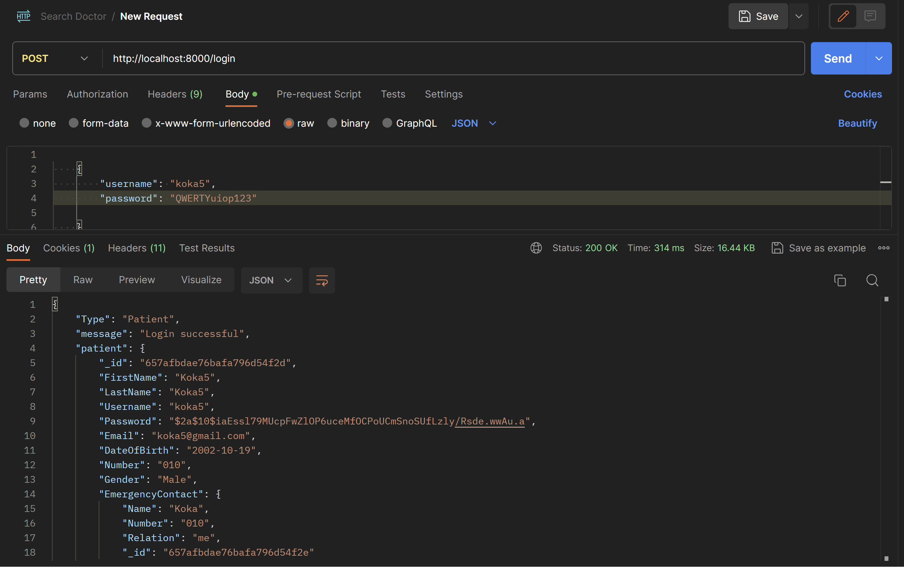

Fetching family members of logged in user

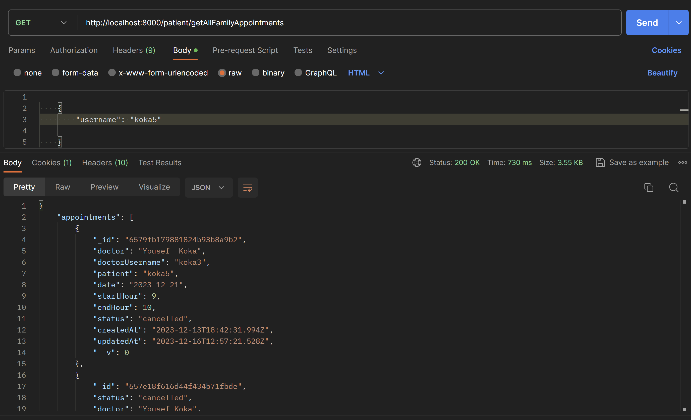

Getting all prescriptions prescriped by a certain doctor

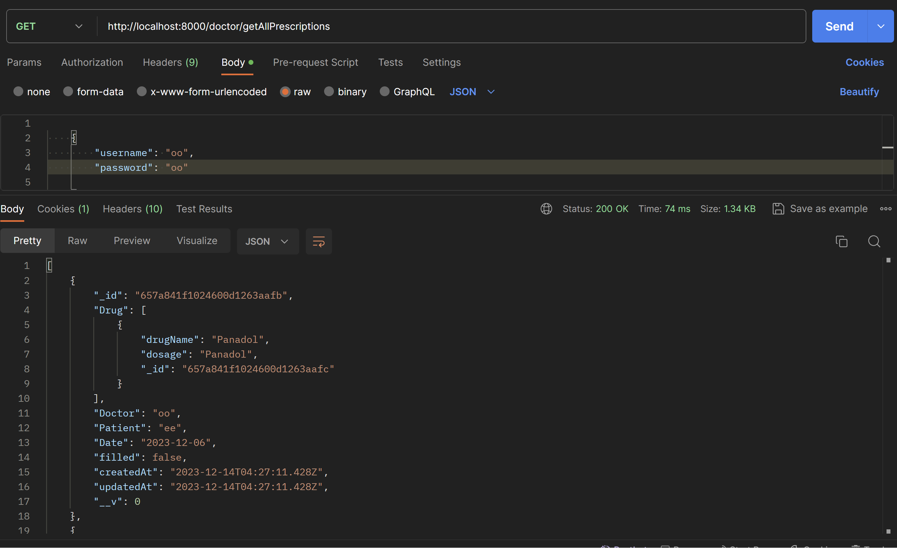

## Contribute
There may be user experience problems on our website that can be handled; perhaps enhancing the website with more features that are satisfying can help it stand out more.